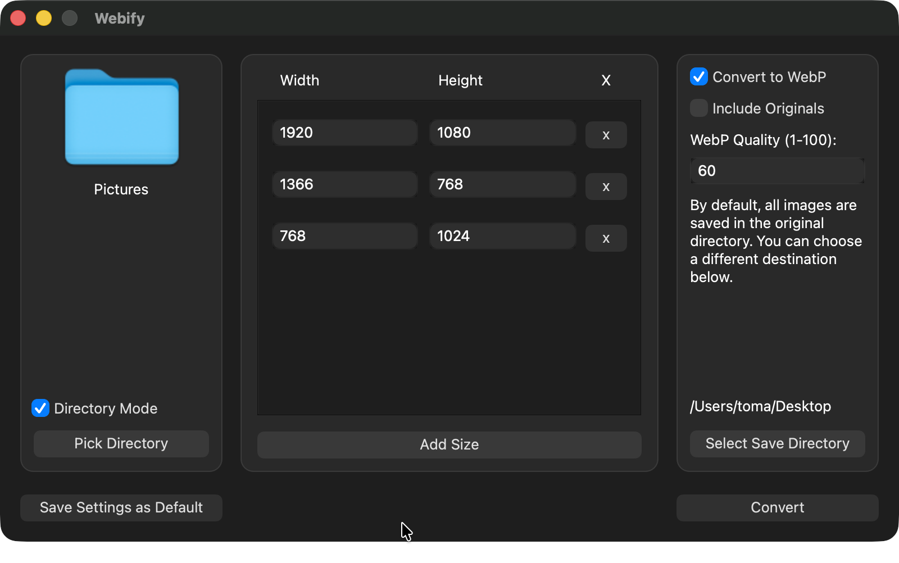

# Webify

A C++ desktop application built with Qt and Vips intended to aid web development by making it easier to make images web ready.

## Overview

The application provides the folllowing functionality:

- Comvert images to WebP
- Set WebP quality
- Convert to multiple sizes in one go
- Single image or folder conversion
- Pick target destination

The application window is divided in to three sections. Left one allows the user to pick target files, middle one allows them to add different sizes and the right one shows different conversion settings.
Current settings can be saved as default and they will be automatically be reloaded upon boot up.

## Screenshot

